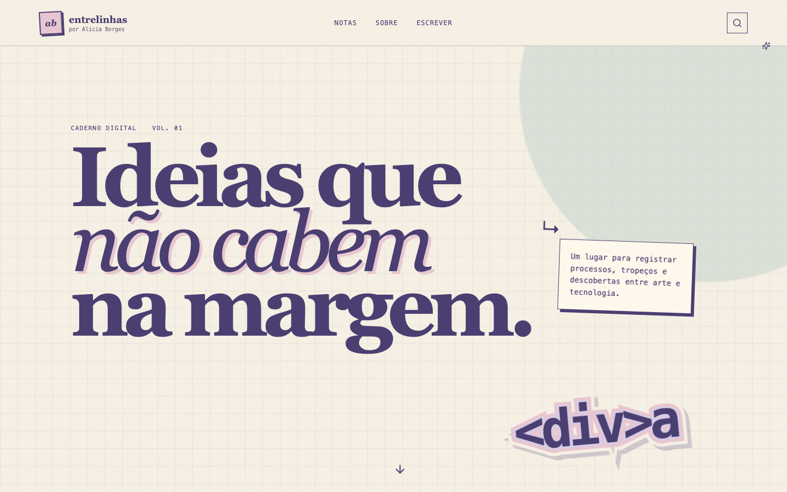

# Entrelinhas — blog de Alicia Borges

Um blog editorial completo para publicar notas sobre código, arte, design e processos criativos. O projeto substitui a antiga API de estudos por uma aplicação real, com site público, painel protegido e persistência no Supabase.



## O que já funciona

- página inicial responsiva com busca e filtros por categoria;
- páginas individuais com conteúdo em Markdown;
- autenticação de autora, sem cadastro público;
- painel para criar, editar, publicar e excluir textos;
- rascunhos, destaque e pré-visualização;
- upload de capas pelo Supabase Storage;
- API pública de leitura em `/api/posts` e `/api/posts/[slug]`;
- Row Level Security para proteger rascunhos e ações administrativas;
- modo de demonstração local quando o Supabase ainda não está conectado.

## Stack

- Next.js 16 com App Router
- TypeScript
- Supabase Auth, Postgres e Storage
- React Markdown
- CSS autoral, sem biblioteca visual pronta

## Rodando localmente

```bash
npm install
cp .env.example .env.local
npm run dev
```

Abra [http://localhost:3000](http://localhost:3000). Sem variáveis de ambiente, o site usa três textos de demonstração e mantém o painel bloqueado.

## Conectando o Supabase

1. Crie um projeto no Supabase.
2. Abra o SQL Editor e execute [`supabase/schema.sql`](supabase/schema.sql).
3. Em Authentication, crie manualmente a conta da autora. O site não oferece cadastro público.
4. Copie a URL e a publishable key para `.env.local`:

```env
NEXT_PUBLIC_SUPABASE_URL=https://SEU_PROJETO.supabase.co
NEXT_PUBLIC_SUPABASE_PUBLISHABLE_KEY=SUA_CHAVE_PUBLICA
```

5. Reinicie o servidor e acesse `/admin/login`.

Nunca coloque uma secret key ou service role key no navegador. As permissões públicas são limitadas pelas políticas RLS do banco.

## Scripts

```bash
npm run dev        # desenvolvimento
npm run typecheck  # validação TypeScript
npm run lint       # análise estática
npm run build      # build de produção
```

## Estrutura principal

```text
app/                 rotas públicas, admin e API
components/          componentes de interface e editor
lib/                 consultas, tipos e clientes Supabase
supabase/schema.sql  banco, storage e políticas RLS
```

Projeto de [Alicia Borges](https://github.com/Lime4idan).
